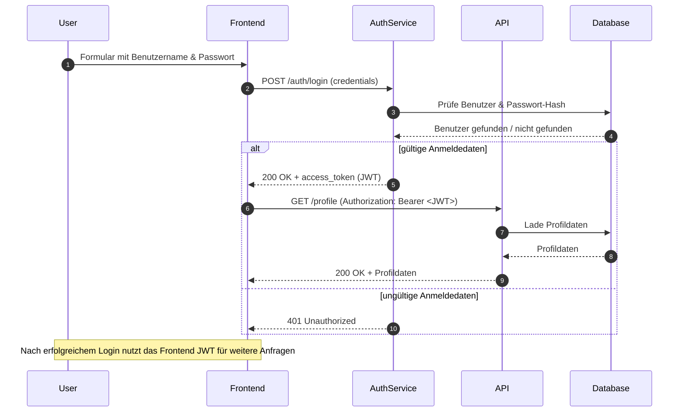

# ESM-Demo-AK-Q4-2025

# ESM-Demo-AK-Q4-2025

// ...existing code...

```mermaid
sequenceDiagram
    autonumber
    participant User
    participant Frontend
    participant AuthService
    participant API
    participant Database

    User->>Frontend: Formular mit Benutzername & Passwort
    Frontend->>AuthService: POST /auth/login (credentials)
    AuthService->>Database: Prüfe Benutzer & Passwort-Hash
    Database-->>AuthService: Benutzer gefunden / nicht gefunden
    alt gültige Anmeldedaten
        AuthService-->>Frontend: 200 OK + access_token (JWT)
        Frontend->>API: GET /profile (Authorization: Bearer <JWT>)
        API->>Database: Lade Profildaten
        Database-->>API: Profildaten
        API-->>Frontend: 200 OK + Profildaten
    else ungültige Anmeldedaten
        AuthService-->>Frontend: 401 Unauthorized
    end
    note over User,Frontend: Nach erfolgreichem Login nutzt das Frontend JWT für weitere Anfragen
```

// ...existing code...
