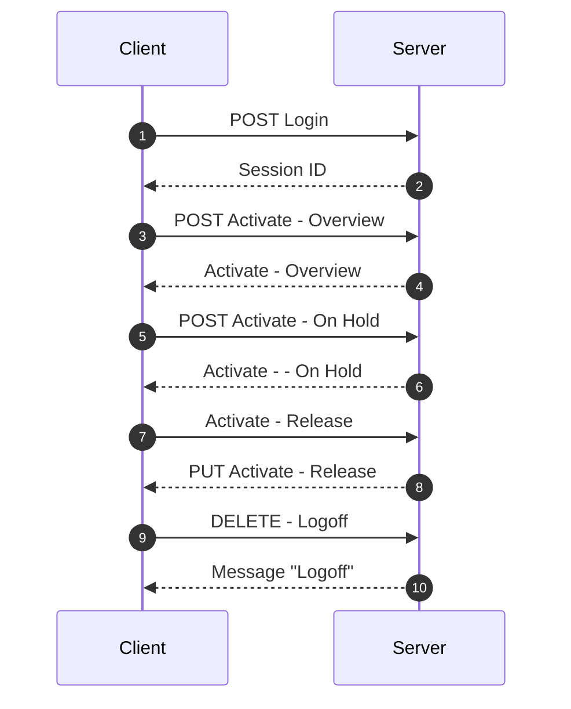
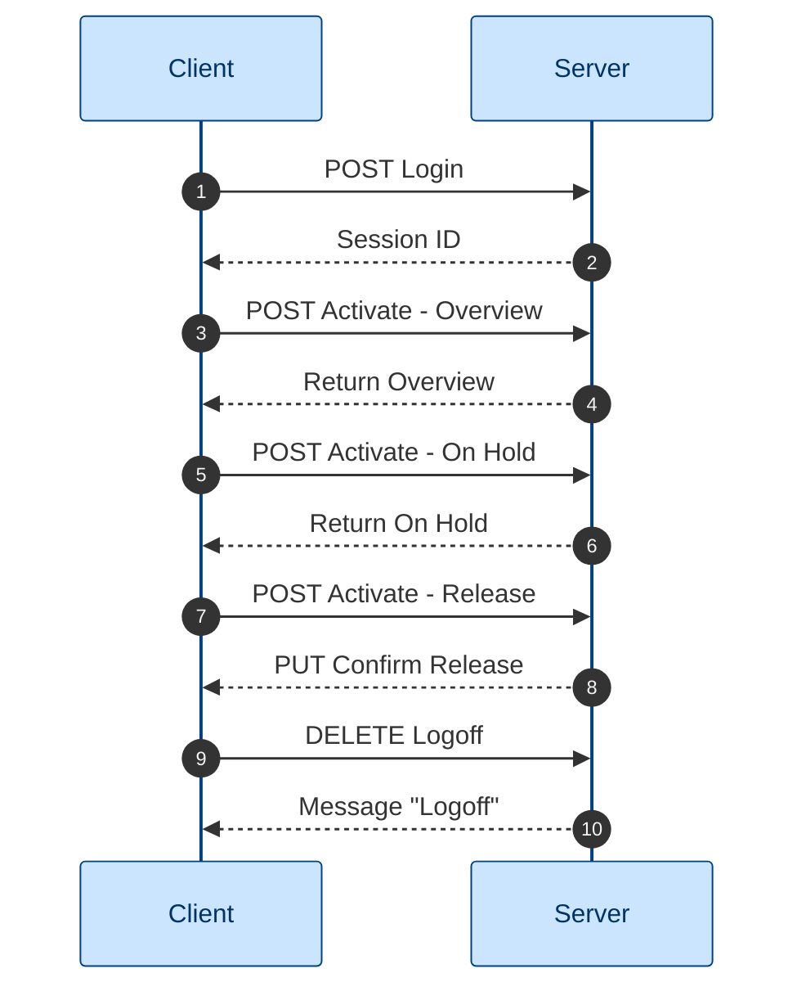

# ESM-Demo-AK-Q4-2025

```mermaid
sequenceDiagram
    autonumber
    participant Client
    participant Server

    Client ->> Server: POST Login
    Server -->> Client: Session ID
    Client ->> Server: POST Activate - Overview
    Server -->> Client: Activate - Overview
    Client ->> Server: POST Activate - On Hold
    Server -->> Client: Activate - - On Hold
    Client ->> Server: Activate - Release
    Server -->> Client: PUT Activate - Release
    Client ->> Server: DELETE - Logoff
    Server -->> Client: Message "Logoff"
```

```mermaid
---
config:
  theme: base
  themeVariables:
    actorBkg: "#cce5ff"          # Hintergrundfarbe der Akteure
    actorBorder: "#004085"       # Rahmenfarbe der Akteure
    actorTextColor: "#003366"    # Textfarbe der Akteure
---
sequenceDiagram
    autonumber
    participant Client
    participant Server

    Client ->> Server: POST Login
    Server -->> Client: Session ID
    Client ->> Server: POST Activate - Overview
    Server -->> Client: Return Overview
    Client ->> Server: POST Activate - On Hold
    Server -->> Client: Return On Hold
    Client ->> Server: POST Activate - Release
    Server -->> Client: PUT Confirm Release
    Client ->> Server: DELETE Logoff
    Server -->> Client: Message "Logoff"
```
